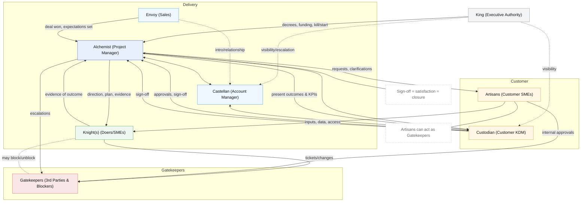

# Roles

We all like codenames right?
Bootstrap has codenames too, codenames are cool and make it sound like you're
highly proficient in some sort of mystic business feng shui.
Boostrap is influenced by medieval heirarchy, which is where the coolest titles come from.

## The Alchemist (Project Manager)

The Alchemist turns chaos into order.
They don't wield swords or hold the purse — they transform uncertainty, politics, and half-formed ideas into signed-off outcomes.

- Mixes raw inputs from Envoys, Artisans, and Gatekeepers into a workable plan.
- Keeps the Custodian satisfied by producing tangible evidence of progress.
- Directs the Knights so their effort becomes outcomes, not wasted quests.
- Filters declarations from the King into achievable campaigns.
- Holds the ledger: records, sign-offs, change logs, and the evidence that protects the project.

The Alchemist is not flashy. Their "magic" is the grind: constant questioning, evidence-gathering, and reshaping lead into gold.
Without the Alchemist, the whole kingdom is just noise and smoke.

## The King (Executive Authority)

The King is the absolute authority in the realm of the project.
They can decree its birth, demand its acceleration, or order its death without warning.

- Holds power above any Key Decision Maker (KDM).
- Can kill a project mid-flight, even if milestones are green.
- Can conjure new projects from thin air, reshaping priorities overnight.
- Rarely deals in detail — outcomes and optics are their domain.
- Sees the project as part of a larger campaign, not as an isolated battle.

When the King speaks, all other roles adjust.
The Alchemist interprets the decree, the Purse Holder manages the funds, the Knights adjust their fight.
The King doesn't ask, they declare.
The Alchemist's job is to translate those declarations into outcomes that can be delivered, signed off, and evidenced.

## The Knight (SME)

The Knight is the one who fights the battles. The Subject Matter Expert.
They install, configure, code, design, or fix. Steel in hand, they get the real work done.

- Skilled in their craft — each Knight has their own discipline.
- Works on the front line, where plans meet reality.
- Needs direction from the Alchemist (PM) to avoid chasing the wrong fight.
- Can be swayed by nobles (customers) into "just doing this one thing" outside scope.
- Tends to underestimate battles ("should be quick"), requiring buffers in the plan.
- When managed well, they are the **engine of delivery**.
- When unmanaged, they can burn time in side quests.

Knights win outcomes, but only if pointed at the right enemy.
The Alchemist sets the field, the Knight fights the fight.

## The Envoy (Sales)

The Envoy is the one who brings news of opportunity and carries the promises of the realm.
They open the doors, shake the hands, and secure the signatures that start a project.

- First into the court of the customer, presenting visions of what could be.
- Wins favour, often by painting outcomes in broad, glowing strokes.
- Hands the campaign over to the Alchemist (PM) and Knights (Doers) once the deal is struck.
- Sets expectations — sometimes higher than reality can deliver.
- Without the Envoy, there is no project. With them, there is often work to realign promises with reality.

The Envoy opens the door.
The Alchemist must decide how to walk through it, and the Knights must fight the battles inside.

## The Castellan (Account Manager)

The Castellan is the keeper of the castle.
Once the Envoy has opened the door, the Castellan ensures the relationship is defended and maintained.

- Protects the account like a fortress, ensuring continuity.
- Keeps customer confidence even when battles inside the walls get messy.
- Provides stability: if the Alchemist (PM) changes, the Castellan is the constant face.
- Guards against hostile incursions — whether from competitors, politics, or faltering delivery.
- Balances loyalty to the King (executive leadership) with loyalty to the customer.

The Envoy brings opportunity.
The Alchemist drives the campaign.
The Castellan holds the walls and keeps the customer inside safe.

## The Custodian (Customer - KDM/SPoC)

The Custodian is the keeper of the customer's investment. This is the Key Decision Maker and/or Single Point of Contact.
They don't swing swords or draft plans — they guard the resources and decide if the work is worth it.

- Controls the budget and has authority to approve or reject milestones.
- Sets priorities in line with business value.
- Satisfaction is the true measure of success: if the Custodian signs off, the outcome is complete.
- Can cancel or redirect the project if it no longer fits their needs.

This is the role the Alchemist (PM) must keep closest.
Their sign-off is law.

## The Artisans (Customer SMEs)

The Artisans are the skilled specialists of the customer's realm.
They know the systems, the processes, and the hidden quirks that make things work — or break.

- Provide the knowledge and access the project depends on.
- Often closest to the actual tools, data, and workflows.
- Can be loyal allies if engaged early, or become blockers if ignored.
- May defend their craft against change, especially if they feel threatened.
- Focus on detail and craft more than overall outcomes.

The Artisans shape the raw material.
Treat them with respect, keep them engaged, and they will build.
Ignore them, and they may stall the entire campaign.

## The Gatekeepers (3rd Parties, Artisans, Potential Blockers)

The Gatekeepers control access.
They hold the keys to systems, processes, approvals, or resources — and nothing moves without their say.

- Can be 3rd party contractors, vendors, or even internal departments.
- Often require formal tickets, approvals, or work orders before acting.
- May slow progress, either by process design or by choice.
- Sometimes protective, sometimes political — always influential.
- Must be managed through the Custodian (Customer KDM/Provost), never assumed to answer directly to the project.

Every castle has a gate.
The Gatekeepers decide who enters and who waits.
Work with them early, document every delay, and escalate when the gate stays shut.

